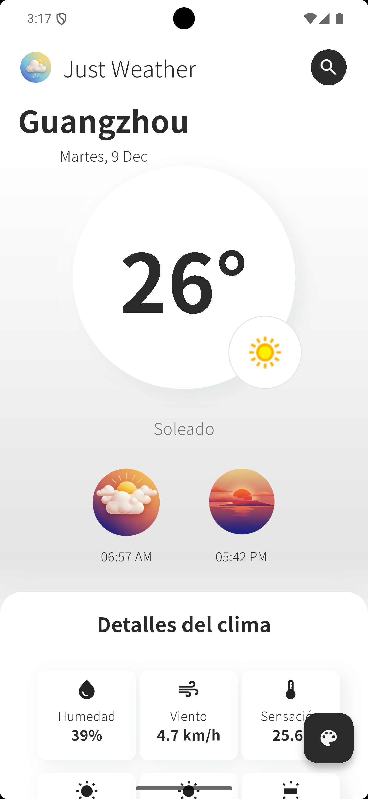
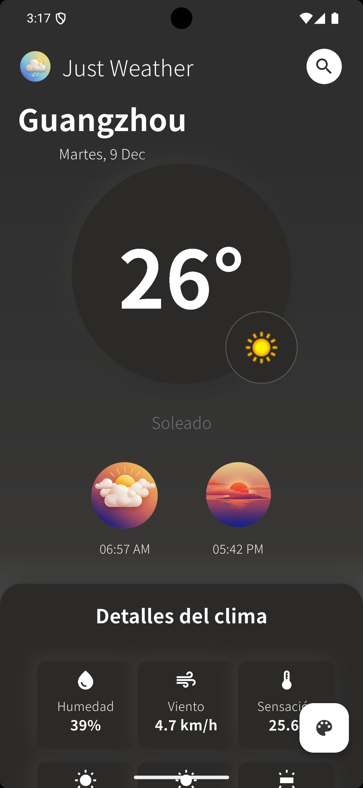
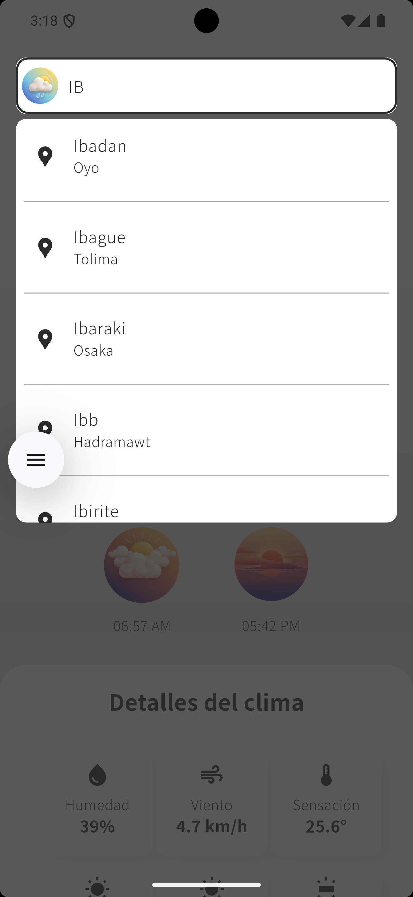
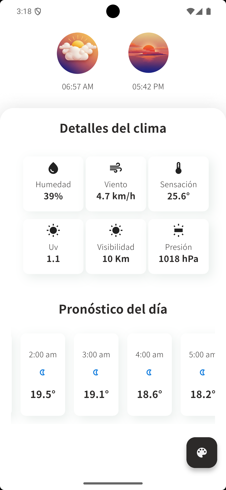

📘 Homez Weather – Flutter Technical Test

Aplicación móvil desarrollada en Flutter que muestra información meteorológica detallada, incluyendo clima actual, pronóstico horario, detalles adicionales, modo claro/oscuro, búsquedas recientes y manejo de ubicación.

🌤️ 1. Descripción General

Homez Weather es una aplicación que permite consultar el clima actual y el pronóstico de cualquier ciudad del mundo.
Utiliza WeatherAPI para obtener datos meteorológicos y una arquitectura basada en Riverpod con componentes UI personalizados y una experiencia de usuario optimizada con skeleton loaders, animaciones y manejo de errores.

Esta app fue desarrollada como parte de una prueba técnica para el rol de Desarrollador Flutter Mobile.

🚀 2. Funcionalidades Principales
✅ Clima actual

Temperatura real

Sensación térmica

Viento, humedad, presión, visibilidad

Amanecer / Atardecer

Índice UV

Probabilidad de lluvia

✅ Pronóstico horario

24 horas (00:00 → 23:00)

Scroll horizontal

Icono, hora y temperatura

✅ Búsqueda inteligente

Barra de búsqueda con debounce (evita llamadas excesivas)

Resultados sugeridos (máximo 5)

Estados: vacío, cargando, error

Búsquedas recientes guardadas en local:

Ver últimas búsquedas

Eliminar individualmente

“Clear all”

✅ Ubicación del usuario

Permisos de ubicación (aceptar/denegar)

Si se acepta → clima por GPS

Si se rechaza → seleccionar capital aleatoria

Manejo de errores de ubicación

✅ UI / UX

Sistema de componentes propio (no se usan kits externos)

Skeleton loaders para toda la pantalla

Responsive (dispositivos móviles / tablets)

Modo claro y modo oscuro

Transición suave entre temas

✅ Errores y estados

Mensajes amigables

Botón “Reintentar”

Skeleton mientras carga

Pantallas vacías

🧱 3. Arquitectura

Se utilizó una arquitectura limpia con separación por capas:

lib/
  config/              # Rutas, temas de la APP
  core/                # Enums, mapeo de errores, utils
  infrastructure/
    helpers/           # Modelos DTO
    repositories/      # Repositorios de datos
  domain/
    gateways/          # Gateways
    mappers/           # Mappers
    modelos/           # Modelos
    use_cases/         # Casos de uso
  ui/
    screens/           # Vistas de la app
    state/             # Providers, states, notifiers
    widgets/           # Componentes UI reutilizables
    themes/            # Gestión de tema Claro/Oscuro

🔍 Manejo de estado: Riverpod

Se utilizó Riverpod por su claridad, rendimiento y desacoplamiento natural.

Ventajas:

Fácil testeo

No requiere BuildContext

Performance óptimo

Providers escalables

🔗 Consumo de API

Cliente construido con http y funciones puras de decodificación JSON.

🎨 Kit de componentes UI

Se construyó un set propio de widgets reusables:

WeatherCard

WeatherDetailTile

HourlyForecastItem

SkeletonContainer

SearchBar

RecentSearchTile

ErrorStateView

🔌 4. Dependencias utilizadas

Solo librerías permitidas dentro del alcance del ejercicio:

Paquete	Uso
riverpod	Manejo de estado
http	Llamadas HTTP
geolocator	Ubicación del usuario
shared_preferences	Búsquedas recientes
flutter_dotenv	API key segura
intl	Formateo de fechas y números
🌍 5. API utilizada

WeatherAPI (plan free)
https://www.weatherapi.com/

Endpoints implementados:

/current.json
/forecast.json
/search.json

📱 6. Screenshot del diseño (UI)

(Aquí agregas tus capturas reales una vez completes la app)

🧪 7. Testing
🔹 Unit Tests

NO SE REALIZAN TEST

💻 8. Instalación y Ejecución
1. Clona el repositorio
git clone https://github.com/AlejandroHomez/just_weather.git
cd just-weather

2. Instala dependencias
flutter pub get

3. Crea el archivo .env
WEATHER_API_KEY={WEATHER_APY_KEY_VALUE}

4. Corre la app
flutter run

🌐 9. Demo Web (Appetize.io)

Puedes probar la aplicación sin instalar nada desde este enlace:

👉 DEMO: https://appetize.io/app/b_roqurrtopcylp6n4pbqzow6m7i

📦 10. Build de Android (APK)
flutter build apk --release

Ubicación del archivo:

/build/app/outputs/flutter-apk/app-release.apk

📦 11. Build de iOS (simulator) (Opcional)
flutter build ios --simulator

🧑‍💻 12. Desarrollado por

Jhon Alejandro Botero Homez
Flutter Developer
Ibagué, Colombia
GitHub: https://github.com/AlejandroHomez

📝 13. Notas Finales

Toda la UI se construyó desde cero, sin kits externos.

Se implementaron animaciones y skeleton loaders en todas las cargas.

La app cumple cada punto requerido en la prueba técnica (API, búsqueda, recientes, forecast, modo oscuro, errores, permisos, responsive).

Se priorizó claridad arquitectónica y mantenibilidad.
